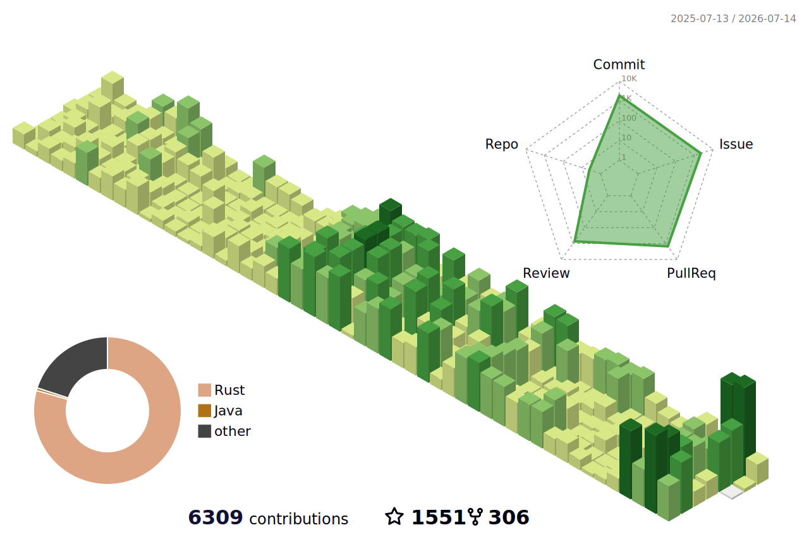

### Hi there 👋
- 👋 Hi, I’m mxsm，Graduated from ***Hangzhou Dianzi University(HDU)***.
- 👨‍💻 A Software Engineer living in Foshan. Working in Guangzhou. ***Good at JAVA, Rustaceans***
- 🌱 I’m currently focused on [***RocketMQ Rust***](https://github.com/mxsm/rocketmq-rust), [***Apache RocketMQ***](https://github.com/apache/rocketmq), [***Apache EventMesh***](https://github.com/apache/eventmesh) and [***DLedger***](https://github.com/openmessaging/dledger).
- 📚 I’m currently learning English and Rust(Premium), GO(Just started).
- 👷 I am looking for a partner developer on [***RocketMQ Rust***](https://github.com/mxsm/rocketmq-rust)
- 👉 [Here](https://blog.ljbmxsm.com) is my personal website. Here is my [juejin Home page ](https://juejin.cn/user/1151943918492855)
- 📫 How to reach me: mxsm@apache.org or ljbmxsm@163.com
- 🔊 **Recently, I have been looking for jobs related to Java and Rust，If there is a suitable job opportunity, please feel free to send an email to mxsm@apache.org. I will respond at the earliest convenience after receiving your message** | 最近，我一直在寻找与 Java 和 Rust 相关的工作。如果有合适的工作机会，请随时发送邮件到 mxsm@apache.org或者微信号:375808041联系。收到您的消息后，我会尽快回复

### Technologies 💻
<table>
  <tr>
    <td></td>
    <td></td>
    <td></td>
    <td></td>
    <td></td>
    <td></td>
    <td></td>
  </tr>
  <tr>
    <td></td>
    <td></td>
    <td></td>
    <td></td>
    <td></td>
    <td></td>
    <td></td>
  </tr>
  <tr>
    <td></td>
    <td></td>
    <td></td>
    <td></td>
    <td></td>
    <td></td>
    <td></td>
  </tr>
</table>

<!--
### Contributing projects

<!--

-->

<!--  -->

### Profile Views
counting of visitors to this page in this section started from July 30, 2023

<!--

  <h3 align="center"> 
    Visitors Count 
    
  </h3>

</img>
-->

<!--

[;Wish%20you%20can%20Day%20Day%20Up%20every%20day!)](https://git.io/typing-svg)

  

**mxsm/mxsm** is a ✨ _special_ ✨ repository because its `README.md` (this file) appears on your GitHub profile.
-->
