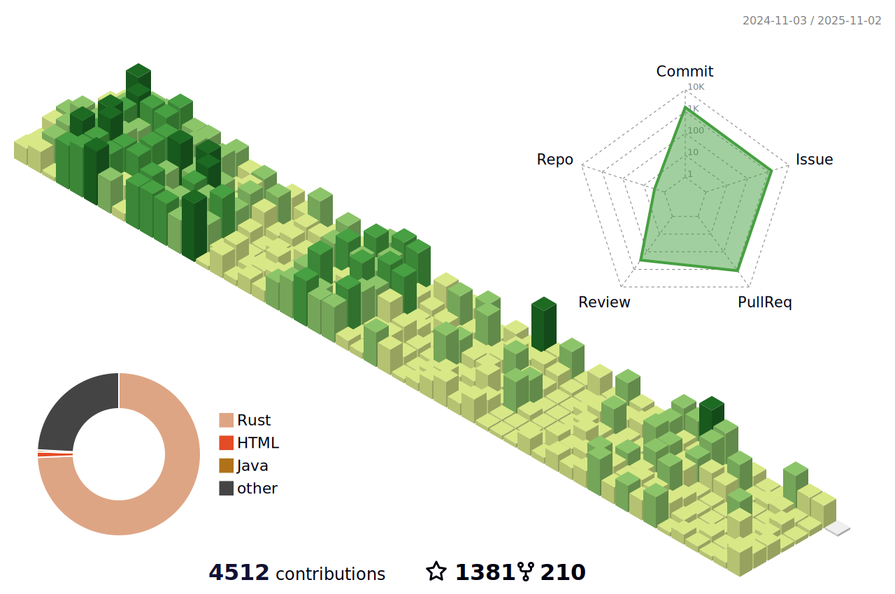

### Hi there 👋
- 👋 Hi, I’m mxsm(蚂蚁背大象)，Graduated from ***Hangzhou Dianzi University(HDU)***.
- 👨‍💻 A Software Engineer living in Foshan. Working in Guangzhou. ***Good at JAVA, Rustaceans***
- 🌱 I’m currently focused on [***Apache RocketMQ***](https://github.com/apache/rocketmq), [***Apache EventMesh***](https://github.com/apache/eventmesh), [***RocketMQ-Rust***](https://github.com/mxsm/rocketmq-rust) and [***DLedger***](https://github.com/openmessaging/dledger).
- 📚 I’m currently learning English and Rust.
- 👉 [Here](https://blog.ljbmxsm.com) is my personal website. Here is my [juejin Home page ](https://juejin.cn/user/1151943918492855)
- 📫 How to reach me: mxsm@apache.org or ljbmxsm@163.com 

### Contributing projects

<!--  -->

### Profile Views
counting of visitors to this page in this section started from July 30, 2023

</img>

## Technologies 💻

  <h3 align="center"> 
    Visitors Count 
    
  </h3>

<!--
[;Wish%20you%20can%20Day%20Day%20Up%20every%20day!)](https://git.io/typing-svg)

  

**mxsm/mxsm** is a ✨ _special_ ✨ repository because its `README.md` (this file) appears on your GitHub profile.
-->
